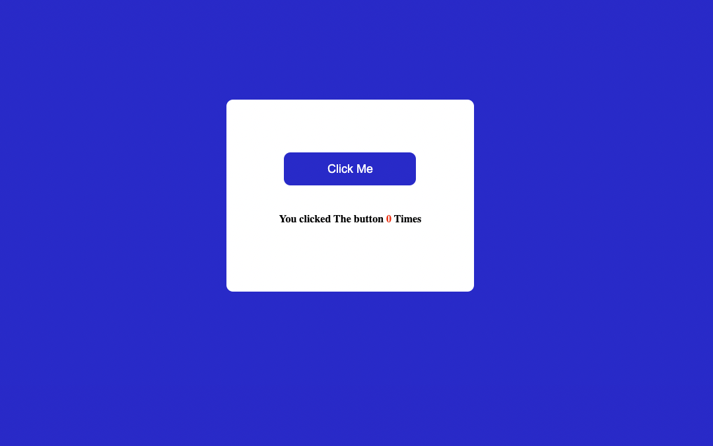

# javscript_codeSandBox_Assingments
by -Divesh Thakre

### In this repo i have uploded 09 assingments rest is uploded individually.

- 
- 
- 
## 01_Accordian 

key learnings:
- adding and removing classes.
- adding Eventlistners.
- working with DOM. 
#
# 02_Rock_paper_&_Sissors 

key learnings:
- adding and removing classes.
- adding Eventlistners.
- working with DOM. 
- DOM Manupulation based on user input.
#
# 03_colour_Changer 

###  By this you can Discover random colours 

key learnings:
- adding Eventlistners.
- working with DOM. 
#
# 04_Random_Password_Generator 

####  These days while creating a new account  we have to think about a different password and we want to make it complex ass well making a password is boring so this Random_Password_Generator will help you.

key learnings:
- adding Eventlistners.
- working with DOM.
- Generating Different string based on user choise. 
#
# 05_joke_generator 

###  By this you can Discover random jokes

key learnings:
- adding Eventlistners.
- working with DOM. 
- working with API.
- fetch() 
#
# 06_QRCode_generator 

###  By this you can generate qr code of any link.

key learnings:
- adding Eventlistners.
- working with DOM. 
- working with API.
#
# 07_Age_calculator 

###  By this you can calculate how Experienced are you.

key learnings:
- adding Eventlistners.
- working with DOM. 
- working with API.
#
# 08_Basic_counter 

###  By this you can count effortlessly.

key learnings:
- adding Eventlistners.
- working with DOM. 
#
# 09_Click_The_Button

###  By this you can count your clicking speed effortlessly.

key learnings:
- adding Eventlistners.
- working with DOM. 

